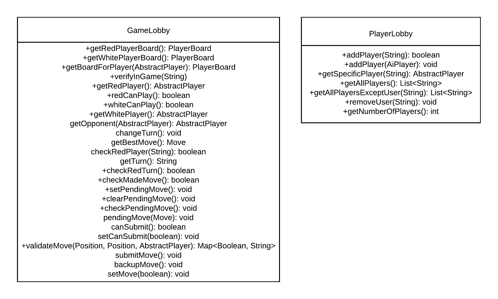

# PROJECT Design Documentation

## Team Information
* Team name: Team C
* Team members
  * Cole Melfi
  * Jake O'Neil
  * Scott Frauenknecht
  * Patrick Swink
  * Pedro Breton

## Executive Summary

This project focuses on the design, development, and maintenance of Software Applications. In order to do this, an online version of the popular board game checkers was created.
For this application, players are required to sign into the system and then can select an opponent from a lobby of players for a match.
When a match starts, the game is played using the American rules with the red player going first. Players can forfeit the game at any point along with sign out from the system at any point.

### Purpose
The purpose of this project is to allow users to play the game of checkers against one another over the internet. 
The game is focused on being accessible for anyone who has internet and would like to play the game.
The goals of the project is to allow players to sign into the game and select another user to 
play against from the lobby of players. Their new goal is to now play the game following the American Rules and hopefully win against their opponent. The user may also elect to logout or forfeit the game at any point.

### Glossary and Acronyms

| Term | Definition |
|------|------------|
| VO | Value Object |
| MVP | Minimal Viable Product |
| UI | User Interface |

## Requirements

This section describes the features of the application.

### Definition of MVP
The MVP (or Minimal Viable Product) is made up of a few standard components. These are outlined below: 

* Sign in/out: Players must be able to sign into and sign out of the system in order for a game to be played.
* Checkers Game: Players must be able to play the game of checkers according to the American Rulebook. The game is made up of the following components:
  * Piece movement: Being able to move a piece during a player's turn
  * Jumping: Players are able to jump opponent's pieces
  * Kinging: Players are able to king their piece by making it to the opposite end of the game board.
* Resign: Players are able to resign from the game at any point and the game ends.

### MVP Features
The MVP Features were broken down into multiple different stories for completion. For our team we broke them down in the following fashion:

* Sign in/out: The ability for users to be able to sign into and sign out of the game.
* Piece Movement: The ability for pieces to be able to move forwards or perform a jump. The jump can either be a single jump or a multi-jump.
* King Movement: The ability for pieces that are of the king type to move forwards or backwards along with preform single and multi jumps forwards and backwards. 
* Resign: The ability for the player to resign the game at any point in time and the game ends once a player resigns. 

### Roadmap of Enhancements
* AI Player: Allows a user to connect to a game and play against the computer (or AI Player) rather than another human being. The AI Player for the system attempts to make the best move possible based upon the following factors:
  * If the move makes a jump or not
  * If a jump is possible, ensure it is the longest one possible
  * If the move results in the player's piece being eaten
  * If the move results in a piece turning into a king piece
* Player Help: Allows a user to request help during their turn. The player, once they have requested help by clicking a button, sees a space highlighted in green. This move is the best move the player can make. The best move is determined by the factors above.

## Application Domain

This section describes the application domain.

The domain model for this project centers around players who sign into the application to play games of checkers against one another. As noted in the diagram, the player can be a regular user or an AI player that the user selects in the game lobby. Once selected, the game is played on a board made up of checkers pieces for each players. At any time during a players turn they can ask for help. The pieces are assigned a color matching the color the player is assigned to for the game. Pieces are either single or king pieces based upon their movement during the game.
Each game of checkers is played on a board complete with two different colored spaces and pieces. 

## Architecture and Design

This section describes the application architecture.

### Summary

The following Tiers/Layers model shows a high-level view of the web app's architecture.

As a web application, the user interacts with the system using a
browser. The client-side of the UI is composed of HTML pages with
some minimal CSS for styling the page. There is also some JavaScript
that has been provided to the team by the architect.

The server-side tiers include the UI Tier that is composed of UI Controllers and Views.

Controllers are built using the Spark framework and View are built using the FreeMarker framework.  The Application and Model tiers are built using plain-old Java objects (POJOs).

Details of the components within these tiers are supplied below.

### Overview of User Interface

This section describes the web interface flow; this is how the user views and interacts
with the WebCheckers application.

The Web Interface Statechart defines the connection routes for the system. Players connect to the game and are directed to the home screen to begin.
Players then have the option to sign into the system and play games of checkers against other signed in players.
Throughout the game, the system is constantly updating to validate moves, complete piece movements, and switch turns until a pair of players complete the game via forfeit or win/loss.
Players have the option to request help during their turn and the system will return the best move possible for them to make.

### UI Tier
This tier acts as the central hub for all user interactions with the backend of the application. All of the routes a player can visit during a game are created and handled here. Any information needed for the views, such as the boards, players, and pieces, are returned when specific routes are visited. Overall, the UI tier returns any of the information needed for the freemarker pages to render the game.

There are two different types of routes created for the system. The first are the get routes. These routes return logic to the frontend and are in charge of getting the board objects and players for the system. These routes are the only routes able to perform redirects. The other type of routes used are post routes. This route expects information to be passed in from the frontend and returns messages to the frontend verifying or denying the statements made by the frontend.

All of the classes for the system are defined below.

One of the most important classes in the system is the GetGameRoute class. This class renders the game board for both of the players and rereads the board for the player as they complete turns. A sequence diagram for the system is below.

The system starts by retrieving the player from the session and then gets the player from the player lobby. From there the GameRoute class calls upon the game lobby to generate a new model board and, in turn, two new Player Boards that they players will see as the game loads. Finally, the redPlayer player board is returned from the gameLobby and then is returned to the frontend from the route request. The second player follows a similar suite however, they only get the player board for the white player rather than creating new boards. This process of retrieving boards continues until the game is over.

Overall, this tier handles all of the actions a player completes that requires logic from the backend. Anytime a player makes a move or clicks a button a different route is called. 

### Application Tier
This tier acts as the mediator of logic and visibility. In charge of holding onto all of the players and games going on in the system, this tier instantiates new users and new game boards for use and whenever something requiring logic happens in the UI tier, this class calls all of the needed information and passes the results back for the user to see. 

There are only two classes that makeup this tier: GameLobby and PlayerLobby. Here is the class diagram for the system:

As you can see, these classes do not directly communicate with one another in any fashion. This is due to each having their own separate functionality for connecting the UI tier to the Model tier. Also, a lot of these methods are getters due to the need to gather information from the model tier, rather than storing logic themselves.

Probably the most important of the two classes is the GameLobby class. It handles all of the connections needed for two players to successfully complete the game. Here is a sequence diagram for setting up a gameboard for the players:

This represents a high-level overview for how a new gameLobby is created. The GetGameRoute instantiates the new class and inside the constructor a new ModelBoard, CheckMove, and two FindBestMoves (one for each player) are created. Finally, the constructor ends by finding the best move for the redPlayer (this starts the state machine and this function is then further called each time a player starts their turn).
 
Overall, this tier completes the connection between the UI and Model tiers, connecting all of the calculations to the views and keeps track of all of the games going on and all of the players connected to the system.

### Model Tier
This tier handles all of the logic for the game system. This tier holds the main logic board, the logic boards used for display for the players, all of the classes that define the pieces, spaces, rows, and the classes that handle calculating the best move a player can make and to verify if a move is possible. 

All of the classes and their connections to one another can be seen in the class diagram below.

Although there are lots of classes in this tier, all follow the OO principles of single responsibility, low coupling, high cohesion, and use the model board as a main source of connection between this tier and the application tier.

One of the most important classes in this tier is the findBestMove class. It handles finding the best move that a player can make and relies upon a state machine for finding the deemed 'best move'. Here is a state diagram for the system.

As seen in the document above, the system always begins in a start state. Dependent on the outcome, the system then moves into a jumping or non-jumping state. If the state is jumping, the system checks to see which of the jumps is then the longest. After this both the non-jumping state and the longest jump state check to see if the jump results in a piece being eaten. Then the system checks to see if the move provided results in a piece becoming a king. If a single best move is not found at the end of all of these checks, one is selected at random. If a single best move has been found, that move is returned.

The criteria for the 'best move' is defined in the enhancements section of this document.

Overall, this tier handles all of the needed calculations and logic needed for a player to complete a game of checkers. Some of the methods defined in the system are used in compliance with the front end's needs (like position and move) while some were created purely to handle backend logic calculations. This tier is vital, as without it, a player would be unable to complete any moves in the system, let alone be a player in the game or have a board to play on.

### Design Improvements
We found large complexity issues surrounding out check move class, our Javadoc coverage metrics, and some of our UI class tiers. However, we did a lot of good things in our system.
A breakdown of each can be found below.

For the UI class tiers, we found issues in the complexity metric
analysis in the number of potential outcomes from the system. We believe this cannot
be fixed, as the cyclomatic complexity of this class is needed for execution in the system.
Without this cyclomatic system, each one of the potential system handles would not be able 
to be met, and we may fail to redirect the system in cases that the user attempts to visit the 
route when a game is not in session.

For our check move class, we found high complexity metrics, specifically in our cyclomatic
complexity check, as the system requires lots of conditional statements for execution. This
issue can be resolved by the implementation of a state machine to check our move validations.
This system would limit the number of conditional statements needed for completion and the 
system would run after every move, making it less time complex overall. Our team decided not
to implement this improvement due to time constraints however, this should be a top priority
for the system if we had more time.

For our Javadoc coverage metrics, we found some classes that missed Javadoc coverage.
For this, we found the locations that the Javadoc coverage was missing and made the proper
changes to the system to ensure all points of the Javadoc coverage was met in the system.

For our lines of code metrics, we found no issues with the system, and the number of lines
for our system did not add any complexity to the system. No changes were made due to the system
not needing any improvements. The system alerted us that we have approximately 4,000 lines of 
active code on our system, with approximately 1,000 lines of comments.

For our Martin package metrics, we found no issues with the system. Our fan-in connections were
highest in our model class however, this makes sense as the model class reaches to other 
classes in our model tier for execution. For each one of the other tiers, their fan-in 
connections were relatively small, as our UI tier and our Application Tier classes did not 
communicate very often with inside themselves. For our fan-out connections, we found the 
highest number of connections needed in our UI Tier. This makes sense as the UI tier relied 
heavily upon all of the classes in our system for functionality and to send all of the 
information to the frontend, so it could be displayed properly for the user.

The overall coupling factor of our system was 20.32%, meaning that we did a good job of 
eliminating coupling in our system. Our attribute hiding factor was 85.15%, meaning that we 
did a good job hiding our attributes in private fields to ensure they were only being 
accessed through getters and setters, rather than other classes having direct contact with 
our attributes. 

For further implementation of fixes to the system, addressing the following areas for usability may  be beneficial for users. These areas include:
* Bigger test for all of the elements in the UI
* More color contrast between the red checker and the black background
* Have a message popup when a user attempts to sign out to ensure they meant to click the sign out button
* Have a message popup allowing a user to decline a game request by another player
* Revisit the checkMove class and change the if statement checks into a state machine to increase performance and clarity

## Testing

To ensure the quality of our project we did created a comprehensive set of tests.
Our test suite consisted mainly of unit tests which was complemented by manual testing done by
our team members and beta testing done by our peers from other SWEN-251 sections and the students of
SWEN-101.

Our unit test were created using junit5 framework along with Mockito to mock our dependencies.
Through are suit of unit test we were looking to ensure the correctness of our implementation. As
this was one of our main goals writing thorough unit test was one of the acceptance criteria for
every story. Our success can be reflected by our overall code coverage of 92% and the package 
coverage of 82%, 96% and 100% for the ui, model and application tiers respectively.

### Acceptance Testing
All story's acceptance criteria was maintained in the Trello board. Each story contained multiple acceptances test
that were imperative to the functionality of each story. As the project progressed the user stories changed
in functionality multiple times. For example the win loss story used to contain acceptance criteria that
required score to be maintained. This was phased out as the project progressed and the stories were updated
to reflect that. Upon the completion of the project all acceptance criteria that remained was met and tested
for functionality.

### Unit Testing and Code Coverage
Our unit testing strategy was to test one part of the code first to make sure it ran and then to move onto the next once
we got the first part to pass. Our coverage targets for the project were 80% for both the application tier and the Ui tier and 95% for the model tier.
We selected these values as they were recommended to be around these percentages. We did not want to go any lower than
95% for the model tier as it is a core tier that needs to be functioning at 100% all the time so having sufficient tests
to confirm that it is running correctly is necessary. Our code coverage is above all target values. The application tier
is at  100%, the model tier is at 97%, and the ui tier is at 82%. There are no currently know anomalies.

