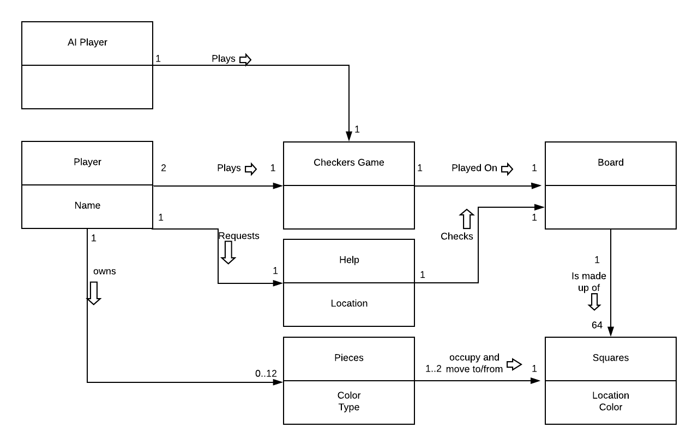
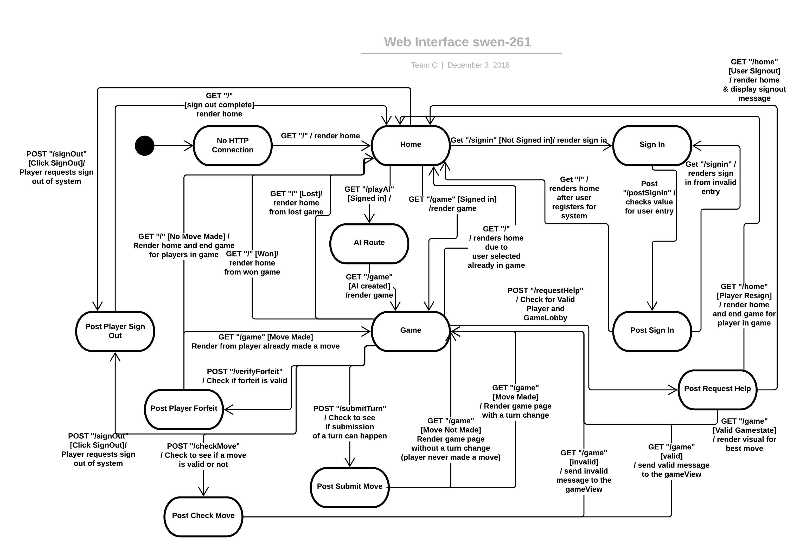

# PROJECT Design Documentation

<!-- _The following template provides the headings for your Design
 Documentation.  As you edit each section make sure you remove these
 commentary 'blockquotes'; the lines that start with a > character
 and appear in the generated PDF in italics._) -->

## Team Information
* Team name: Team C
* Team members
  * Cole Melfi
  * Jake O'Neil
  * Scott Frauenknecht
  * Patrick Swink
  * Pedro Breton

## Executive Summary

This project focuses on the design, development, and maintenance of Software Applications. In order to do this, an online version of the popular board game checkers was created.
For this application, players are required to sign into the system and then can select an opponent from a lobby of players for a match.
When a match starts, the game is played using the American rules with the red player going first. Players can forefit the game at any point along with signout from the system at any point.

### Purpose
> _Provide a very brief statement about the project and the most
> important user group and user goals._

### Glossary and Acronyms
> _Provide a table of terms and acronyms._

| Term | Definition |
|------|------------|
| VO | Value Object |

## Requirements

This section describes the features of the application.

> _In this section you do not need to be exhaustive and list every
> story.  Focus on top-level features from the Vision document and
> maybe Epics and critical Stories._

### Definition of MVP
> _Provide a simple description of the Minimum Viable Product._

### MVP Features
> _Provide a list of top-level Epics and/or Stories of the MVP._

### Roadmap of Enhancements
> _Provide a list of top-level features in the order you plan to consider them._

## Application Domain

This section describes the application domain.

The domain model for this project centers around players who sign into the application to play games of checkers against one another. 
Each game of checkers is played on a board complete with two different colored spaces and pieces. 

## Architecture and Design

This section describes the application architecture.

### Summary

The following Tiers/Layers model shows a high-level view of the webapp's architecture.

As a web application, the user interacts with the system using a
browser.  The client-side of the UI is composed of HTML pages with
some minimal CSS for styling the page.  There is also some JavaScript
that has been provided to the team by the architect.

The server-side tiers include the UI Tier that is composed of UI Controllers and Views.
Controllers are built using the Spark framework and View are built using the FreeMarker framework.  The Application and Model tiers are built using plain-old Java objects (POJOs).

Details of the components within these tiers are supplied below.

### Overview of User Interface

This section describes the web interface flow; this is how the user views and interacts
with the WebCheckers application.

The Web Interface Statechart defines the connection routes for the system. Players connect to the game and are directed to the home screen to begin.
Players then have the option to sign into the system and play games of checkers against other signed in players.
Throughout the game, the system is constantly updating to validate moves, complete piece movements, and switch turns until a pair of players complete the game via forfeit or win/loss.

### UI Tier
> _Provide a summary of the Server-side UI tier of your architecture.
> Describe the types of components in the tier and describe their
> responsibilities.  This should be a narrative description, i.e. it has
> a flow or "story line" that the reader can follow._

> _At appropriate places as part of this narrative provide one or more
> static models (UML class structure or object diagrams) with some
> details such as critical attributes and methods._

> _You must also provide any dynamic models, such as statechart and
> sequence diagrams, as is relevant to a particular aspect of the design
> that you are describing.  For example, in WebCheckers you might create
> a sequence diagram of the `POST /validateMove` HTTP request processing
> or you might show a statechart diagram if the Game component uses a
> state machine to manage the game._

> _If a dynamic model, such as a statechart describes a feature that is
> not mostly in this tier and cuts across multiple tiers, you can
> consider placing the narrative description of that feature in a
> separate section for describing significant features. Place this after
> you describe the design of the three tiers._

### Application Tier
> _Provide a summary of the Application tier of your architecture. This
> section will follow the same instructions that are given for the UI
> Tier above._

### Model Tier
> _Provide a summary of the Application tier of your architecture. This
> section will follow the same instructions that are given for the UI
> Tier above._

### Design Improvements
> _Discuss design improvements that you would make if the project were
> to continue. These improvement should be based on your direct
> analysis of where there are problems in the code base which could be
> addressed with design changes, and describe those suggested design
> improvements. After completion of the Code metrics exercise, you
> will also discuss the resutling metric measurements.  Indicate the
> hot spots the metrics identified in your code base, and your
> suggested design improvements to address those hot spots._
We found large complexity issues surrounding out check move class, our javadoc coverage metrics
, and some of our UI class tiers. However, we did a lot of good things in our system.
A breakdown of each can be found below.

For the UI class tiers, we found issues in the complexity metric
analysis in the number of potential outcomes from the system. We believe this cannot
be fixed, as the cyclomatic complexity of this class is needed for execution in the system.
Without this cyclomatic system, each one of the potential system handles would not be able 
to be met, and we may fail to redirect the system in cases that the user attempts to visit the 
route when a game is not in session.

For our check move class, we found high complexity metrics, specificially in our cyclomatic
complexity check, as the system requires lots of conditional statements for execution. This
issue can be resolved by the implementation of a state machine to check our move validations.
This system would limit the number of conditional statements needed for completion and the 
system would run after every move, making it less time complex overall. Our team decided not
to implement this improvement due to time constraints however, this should be a top priority
for the system if we had more time.

For our javadoc coverage metrics, we found some classes that missed javadoc coverage. 
For this, we found the locations that the javadoc coverage was missing and made the proper
changes to the system to ensure all points of the javadoc coverage was met in the system.

For our lines of code metrics, we found no issues with the system, and the number of lines
for our system did not add any complexity to the system. No changes were made due to the system
not needing any improvements. The system alrerted us that we have approximately 4,000 lines of 
active code on our system, with approximately 1,000 lines of comments.

For our Martin package metrics, we found no issues with the system. Our fan-in connections were
highest in our model class however, this makes sense as the model class reaches to other 
classes in our model tier for execution. For each one of the other tiers, their fan-in 
connections were relaively small, as our UI tier and our Application Tier classes did not 
communicate very often with inside themselves. For our fan-out connections, we found the 
highest number of connections needed in our UI Tier. This makes sense as the UI tier relied 
hevily upon all of the classes in our system for functionality and to send all of the 
information to the frontend so it could be displayed properly for the user.

The overall coupling factor of our system was 20.32%, meaning that we did a good job of 
eliminating coupling in our system. Our attribute hiding factor was 85.15%, meaning that we 
did a good job hiding our attribues in private fields to ensure they were only being 
accessed through getters and setters, rather than other classes having direct contact with 
our attributes. 

## Testing
> _This section will provide information about the testing performed
> and the results of the testing._

### Acceptance Testing
> _Report on the number of user stories that have passed all their
> acceptance criteria tests, the number that have some acceptance
> criteria tests failing, and the number of user stories that
> have not had any testing yet. Highlight the issues found during
> acceptance testing and if there are any concerns._

### Unit Testing and Code Coverage
> _Discuss your unit testing strategy. Report on the code coverage
> achieved from unit testing of the code base. Discuss the team's
> coverage targets, why you selected those values, and how well your
> code coverage met your targets. If there are any anomalies, discuss
> those._
